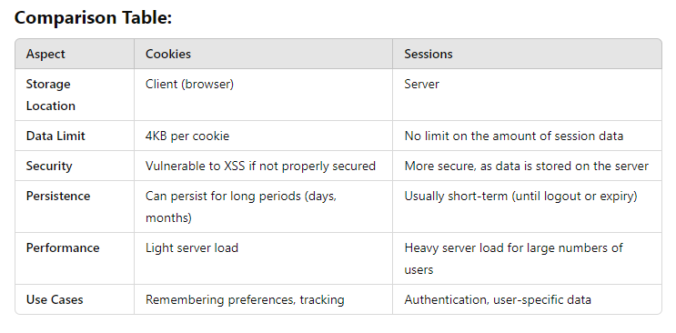

# **Session vs Cookie: A Clear Workflow with Advantages and Disadvantages**

In web development, both **sessions** and **cookies** are used to store and track user data. Let’s explore their workflows and understand when to use each, their pros and cons, and some examples.

---

## **Workflow of Cookies** (Client-Side Storage)

1. **User Makes a Request (First Visit)**:
   - The user visits a website, for example, `www.example.com`.
   - The browser sends a request to the server without any cookies (since this is the first visit).

2. **Server Sets a Cookie**:
   - The server processes the request and sends a **cookie** back to the browser. This cookie can store simple data like a user ID, preferences, or authentication tokens.
  
   ``` css
   Set-Cookie: userId=12345; Expires=Wed, 21 Oct 2025 07:28:00 GMT; HttpOnly
   ```

3. **Browser Stores the Cookie**:
- The browser stores the cookie with the name-value pair (e.g., `userId=12345`) and attaches it to all future requests to the same domain.

4. **User Makes Subsequent Requests**:
- The browser sends the stored cookie automatically with every subsequent request to the server.

    **Example Request**:
    ``` vbnet
    GET /profile
    Cookie: userId=12345
    ```

5. **Server Reads the Cookie**:

 -  The server receives the request along with the  cookie and processes it. For example, it retrieves the user's information using the userId stored in the cookie.


## **Workflow of Sessions** (Server-Side Storage)

1. **User Makes a Request (First Visit)**:
    - The user visits a website, for example, `/login`.
    - The browser sends a request to the server with no session information yet (since it’s the first visit).

2. **Server Creates a Session**:
    - The server creates a **session** on the server to store user-specific data, such as the user's authentication status.
    - The server generates a unique **session ID** to associate with this session.

3. **Server Sends Session ID in a Cookie**:
    - The server sends the session ID to the browser in a cookie (e.g., `sessionId=abcd1234`).


    **Example Response**:
    ``` vbnet
    Set-Cookie: sessionId=abcd1234; HttpOnly
    ``` 
4. **Browser Stores the Cookie**:
    - The browser stores the session ID cookie.

5. **User Makes Subsequent Requests**:
    - The browser automatically sends the session ID cookie with every request.

   **Example Request**:
   ```vbnet
    GET /profile
    Cookie: sessionId=abcd1234
   ```              

6. **Server Retrieves Session Data**:
    - The server uses the session ID to retrieve the associated session data stored on the server, like the user’s login status or preferences.
    - If the session is still valid, the user is authenticated and can proceed.

7. **Session Ends (Logout or Expiry)**:
    - The session can be destroyed either by the user logging out or when it expires after a set time. Once destroyed, the session ID becomes invalid.

---

## **When to Use Cookies** (Client-Side Storage)

### **Advantages**:
- **Client-Side Storage**: Cookies are stored in the user's browser, meaning no extra load on the server.
- **Persistent**: Cookies can be set to last for days, months, or even years by specifying an expiration date.
- **Easy to Use**: Storing small amounts of data, like preferences or tracking data, is straightforward.
- **Stateless**: Cookies can help maintain state in a stateless protocol like HTTP (such as remembering login status).

### **Disadvantages**:
- **Size Limit**: Cookies can only store up to 4KB of data, making them unsuitable for storing large amounts of data.
- **Security**: Cookies are vulnerable to attacks like cross-site scripting (XSS) if not secured with attributes like `HttpOnly` and `Secure`.
- **Browser-Dependent**: Users can disable cookies, which might break functionality that depends on them.

### **When to Use Cookies**:
- For **remembering user preferences** (e.g., language or theme selection).
- For storing **non-sensitive data** like a shopping cart ID.
- For **lightweight, long-term storage** across browser sessions (like “remember me” login).

---

## **When to Use Sessions** (Server-Side Storage)

### **Advantages**:
- **Server-Side Security**: Since session data is stored on the server, it’s much more secure than cookies. Only the session ID is stored in the browser.
- **Large Data Storage**: Sessions can store large amounts of data, as they are not limited by the 4KB limit of cookies.
- **Short-Term Storage**: Sessions are typically used for short-term storage, such as authentication data, which is destroyed after logout or expiration.

### **Disadvantages**:
- **Increased Server Load**: Since session data is stored on the server, it can put additional load on the server as the number of users increases.
- **Not Persistent**: Sessions are generally destroyed when the user logs out or the session expires, meaning they don’t persist for long periods.
- **Requires Cookie Support**: Sessions rely on cookies to store the session ID, so if cookies are disabled, sessions can be harder to manage.

### **When to Use Sessions**:
- For **storing sensitive user data** like authentication tokens or login states.
- For **user-specific data** that should only be stored during the session (like cart items before checkout).
- For **short-term storage** of data that should expire when the user logs out or closes the browser.

---   




**Conclusion:**
- Use Cookies: When you need to store small, non-sensitive data that needs to persist across multiple browser sessions (e.g., user preferences, tracking IDs).
- Use Sessions: When you need to store sensitive or large amounts of data temporarily, like user authentication and shopping carts.